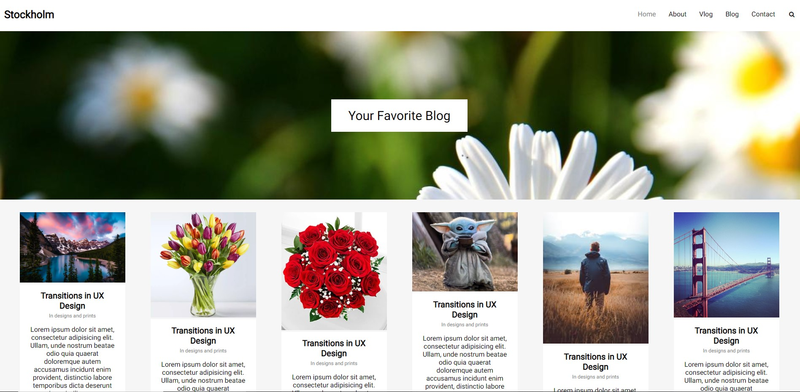

<h1 align="center">
  Your Favorite Blog
</h1>

<p align="center">
  <a href="#rocket-project">Project</a>&nbsp;&nbsp;&nbsp;|&nbsp;&nbsp;&nbsp;
  <a href="#computer-technologies">Technologies</a>&nbsp;&nbsp;&nbsp;|&nbsp;&nbsp;&nbsp;
  <a href="#thinking-how-to-use">How to use?</a>&nbsp;&nbsp;&nbsp;|&nbsp;&nbsp;&nbsp;
  <a href="#memo-license">License</a>
</p>

## :rocket: Project

:globe_with_meridians: 
developed in Codenation AceleraDev React 

## Preview

<div style="display: flex align-items: center">

</div>

## :computer: Technologies
- HTML
- CSS

## :thinking: How to use?

```sh
Open index.html file
```


## :memo: License

MIT
